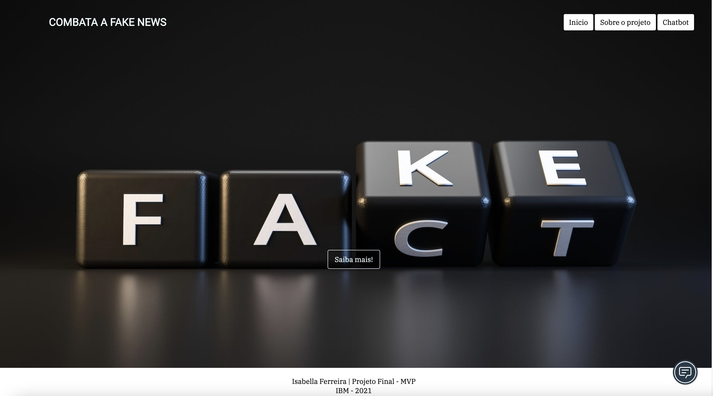
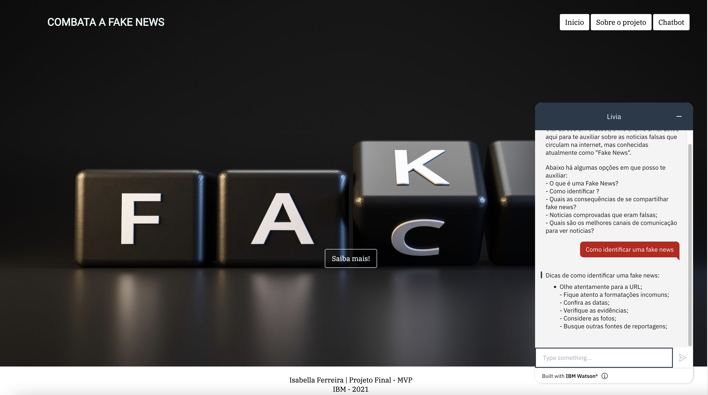

## Projeto MVP - Future Club.

### 🚀 Tecnologias

Esse projeto foi desenvolvido com as seguintes tecnologias:

- HTML e CSS;
- Watson Assistant - Produto IBM.
- Watson Discovery - Produto IBM.

### 💻 Projeto - Combate a Fake News
A construção do projeto foi feita através das ferramentas da IBM, com o Watson Assistant e o Watson Discovery. Com o objetivo de construir um chatbot no Watson Assistant, adicionando a capacidade de acessar o Watson Discovery, o que significa que diretamente o chatbot pode consultar o mecanismo de pesquisa e descoberta, para encontrar respostas e perguntas que um assistente virtual não responderia. Com a junção dessas ferramentas foi possível criar o projeto de combate a fake News.

O Watson Assistant foi utilizado para a criação do chatbot para simular interações com humanos por meio de texto. A assistente foi treinada com algumas palavras específicas predefinidas com o objetivo de responderem à algumas perguntas que contenha algum sentido em relação ao tema principal, como por exemplo, o que é uma fake news, como identificar uma fake news, entre outros tópicos.

A segunda ferramenta utilizada foi o Watson Discovery porque ele permite que faça o upload de dados e depois uma extração de respostas do documento. A extração foi possivel através do Smart Document Understanding (SDU), que treina o Discovery para extrair campos customizados nos documentos. A customização dos documentos é indexada no Assistant que melhora as respostas de retorno para o usuario. 

E o objetivo de utilizar essas duas ferramentas é que um complementa o outro. Enquanto o Watson Assistant aborda as perguntas mais frequentes e usa estratégias de raciocínio para responder a questões simples, o Discovery usa estratégias de raciocínio que se concentram na identificação da resposta mais apropriada para questões mais complexas. 

###  Links para saber mais sobre as tecnologias usadas:
- Discovery: https://www.ibm.com/br-pt/cloud/watson-discovery
- Assistant: https://www.ibm.com/br-pt/products/watson-assistant
---
Feito por Isabella Ferreira 🚀

